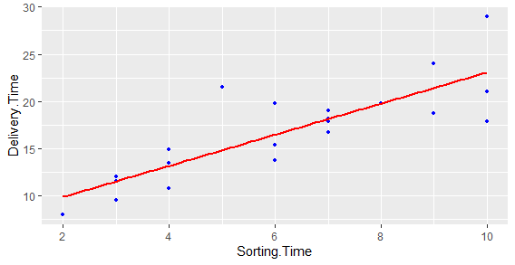

# LinearRegression

1) Delivery_time -> Predict delivery time using sorting time 
2) Salary_hike -> Build a prediction model for Salary_hike

------------------------------------------------------------

Build a simple linear regression model by performing EDA and do necessary transformations and select the best model using R or Python.

Regression analysis is a very widely used statistical tool to establish a relationship model between two variables. One of these variable is called predictor variable whose value is gathered through experiments. The other variable is called response variable whose value is derived from the predictor variable.

In Linear Regression these two variables are related through an equation, where exponent (power) of both these variables is 1. Mathematically a linear relationship represents a straight line when plotted as a graph. A non-linear relationship where the exponent of any variable is not equal to 1 creates a curve.

The general mathematical equation for a linear regression is −

y = ax + b

Following is the description of the parameters used −

y is the response variable.

x is the predictor variable.

a and b are constants which are called the coefficients.

# Excel Analysis

# R Analysis

# After scaling

